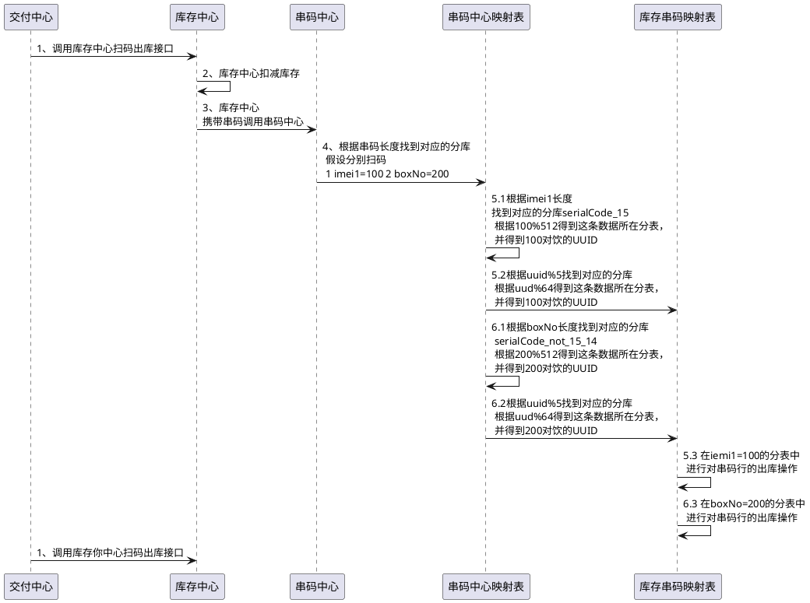

# 库存中心分库分表设计

<!--more-->

### 一、背景

* 1、库存与串码再领域模型上分离。库存属于逻辑概念，串码与实物一一对应，属于实体概念。
* 2、串码数据量较大，需要做分库/分表，优化串码查询性能
* 3、在线串码表需要定期备份，将历史数据迁移至历史库，优化串码查询性能。
* 注： 所有非在线交易类的串码问题参考：串码详情ES大宽表方案

### 二、数据分片方案

* 串码中心数据分片方案的出发点：
* 【问题1】解决大量串码信息存储问题
* 【问题2】解决数据分片后在线交易串码精准查找问题（海外VRS出库场景，指定imei1货imei2）。
* 【问题3】解决数据分片后在线交易串码模糊查找问题（如v-work扫码出库场景，给定任意一个数字（可能是imei1,imei2,itemCode,boxNo等任意一种属性）查找对应的串码信息）.

#### 2.1 方案一 -- 只分表不分库

* 【优点】

> * 所有数据均在一个库中，不存在跨库的分布式事务，不存在多数据源处理。
> * 代码逻辑较为简单，只需要维护分表的逻辑即可。

* 【缺点】

> * 串码库发生抖动，所有代理的所有串码相关业务都受到影响。
> * 单库的性能瓶颈，数据量增大后无法水平扩展数据库的性能。
> * 不能解决问题2和问题3 ---- imei1，imei2，meid，boxNo，itemCode通过同一个接口扫码出库实现不了，调拨场景也无法准确定位到这批串码（imei1……）所在的分库。

#### 2.2 方案2 -- 按代理分库

* 【优点】

> * 每一个代理的数据在一个库中，串码库发生抖动不会影响其他的代理。
> * 分多个库的性能比方案一中单库的性能高很多。

* 【缺点】

> * 代理间的调拨，涉及多个数据源的分布式事务问题。
> * 不能解决问题2和问题3 ---- imei1，imei2，meid，boxNo，itemCode通过同一个接口扫码出库实现不了，调拨场景也无法准确定位到这批串码（imei1……）所在的分表。

#### 2.3 方案3 -- 按UUID分库且分表

##### 2.3.1 【前提】

> * MES 一代串码同步到v-work库存中心时，有库存中心为每条串码生成全局唯一的UUID（和平台组沟通，可以较高的效率生成全局唯一的UUID）
> * 现有的业务数据规则：

```
1. IMEI1、IMEI2固定是15位数字（8位tac+6位流水+1位校验码）例如：“865224038614541”
1. MEID固定是14位字符（8位头+6位16进制的流水）例如：“A00000754A0AEB”
1. BOX_NO手机：18位字符；IOT ：BOX_NO 长度不固定
```

##### 2.3.2 【串码映射表】

> * 串码信息表 (1) --> 串码映射表（N） --> 串码详情表
> * 串码映射表,

| uuid            | value           | 备注     |
| --------------- | --------------- | -------- |
| 123456780123456 | 865224038614541 | imei1    |
| 123456780123456 | 145416830422568 | imei2    |
| 123456780123456 | A00000754A0AEB  | meid     |
| 123456780123456 | 210616830422562 | boxNo    |
| 123456780123456 | 264224038614542 | itemCode |

> * 库存串码表

| uuid      | first_agent_code | ime1       | ime2     | meid   | boxNo  | itemCode | arehouse_code | account_id | sku_code |
| --------- | ---------------- | ---------- | -------- | ------ | ------ | -------- | ------------- | ---------- | -------- |
| 123123123 | 5454545454       | 6363636363 | 73737373 | 838383 | 321123 | 93939393 | 654321        | 100010001  | 456789   |

---

* 【优点】

> * 分多个库的性能比方案一中单库的性能高很多，可以解决大量串码存储问题
> * 可以解决问题2和问题3

* 【缺点】

> * 串码映射表冗余了很多数据，存储空间增加
> * 串码映射表大量的数据存储将会带来性能瓶颈。（1亿串码*5个映射维度 = 5亿的数据量）

##### 2.3.3 【串码映射表、库存串码表分库分表】

* 在2.3.1【前提】中，可以发现业务长度的数据是有一些规律的，可以利用业务数据的长度特性针对2.3.2【串码映射表】做分库分表处理。
* 根据业务数据的长度，将串码映射表拆分为3个库（每个库按uuid分为512张表）：

> * 1）长度为15的imei1和imei2与uuid的映射库
> * 2）长度14的meid与uuid的映射库
> * 3）长度不为14且不为15的boxNo，itemCode与uuid的映射库

##### 2.3.4 【扫码出库场景分析】



* 以上步骤5和步骤6涉及跨串码中心2个库的分布式事务，spring支持跨多数据源事务
* 

##### 2.3.5 【串码数据规模预估】

* 【串码映射表】
* （1） 串码映射表容量预估：

> * 在2.3.3【串码映射表、库存串码表分库分表】中串码映射表的分库分表规则：
> * 3个DB * 512张表/DB * 500~1000万数据/表（为确保MySql性能最优） = 76.8亿~153.6亿，即串码映射表最多可容纳153.6亿条串码与UUID的映射数据

* （2） 业务所需映射表容量预估：

> * 按现有手机业务规模（1亿销售/年），同比预估iot未来业务规模（一亿销量/年）：
> * 【1亿手机+1亿iot】*5 （imei1，imei2,meid,boxNo,itemCode会对应5条映射记录） =10 亿，即未来业务规模对应的串码映射表数量为10亿

* **【结论1】2.3.3【串码映射表、库存串码表分库分表】中将串码映射表分为3个库，每个库分512张表，完全可以满足未来业务需求**
* 因串码映射表是很少的2列（UUID和业务码值），因此每条串码映射的数据量都很小。

> * 假设UUID为64位（最大位数），业务码值也为64位，即一条串码映射的数据量为：128位的字符串，即128字节（java字符串中，英文，数字，符号各占1字节），即0.1KB
> * 为了应对未来的变化，假设串码映射表单条数据增加到0.5kb
> * 串码映射表容量最大：76.8亿~153.6亿 * 0.5KB = 38.4 ~76.8亿KB=3.8T~7.6T
> * 业务所需映射表容量：10亿*0.5KB = 500GB
> * 假设一个Redis/ES节点内存容量 = 100GB，即支撑手机1亿/年，iot1亿/年，需要10个Redis/ES组成的cluster集群（每个Redis/Es节点一主一从，单节点就要5个）

* **【结论2】为了提升串码映射表的性能，支撑手机1亿/年，iot 1亿/年的销量，可以将串码映射表数据存储在redis中，缓存时间为1年。如果业务数据持续增大，可以缩小缓存时间范围（如缓存半年，超过半年的查DB）**
* 【库存串码表】
* （1）容量预估

> * 在2.3.3【串码映射表、库存串码表分库分表】中串码库存串码表的分库分表规则：
> * 5个DB * 64张表/DB * 500~1000万数据/表（为确保MySql性能最优） = 16亿~32亿，即库存串码表最多可容纳32亿条串码与UUID的映射数据

* **【结论3】库存串码表最多容纳32亿条数据，以手机1亿/年，iot1亿/年的销量欸参考值，预计库存串码表可以容纳16年内的实时交易数据（根据业务需求，历史库存串码信息数据可以清理到历史库）**

### 三、总结

* **1）串码映射表MySql: 最大业务容量-2亿/年（手机，IOT各1亿）.最大容量 -- 在MySql分为3个库，每个库512张表，预计可以容纳76.8亿~153.6亿条串码记录，预计可以容纳30年内的串码映射记录**
* **2）串码映射表缓存：优化SQL查询路径，将串码映射表做缓存，最大业务容量（手机1亿/年，iot1亿/年）需要500GB内存，约10个Redis/ES集群，含主备**
* **3）串码映射表缓存容量增长：【方案1】增加Redis/ES 集群中的节点数量。【方案2】增加新的K-V型中间件（如淘宝tiar），纯内存与磁盘顺序写并存。**
* **4）库存串码表：最大容量可以容纳32亿条串码数据库，按最大业务容纳（手机1年/年，IOT1年/年）计算，预计可以容纳16年内的实时交易数据。**

